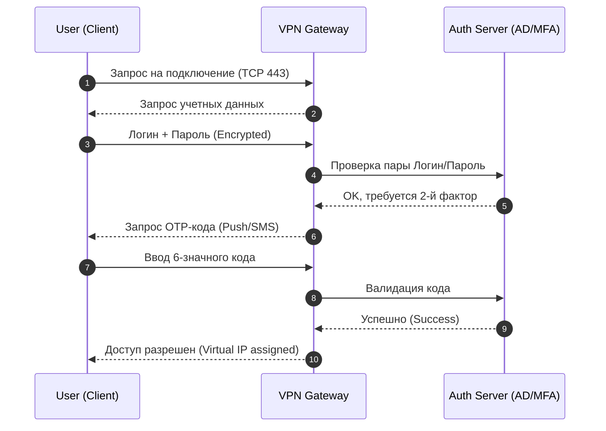
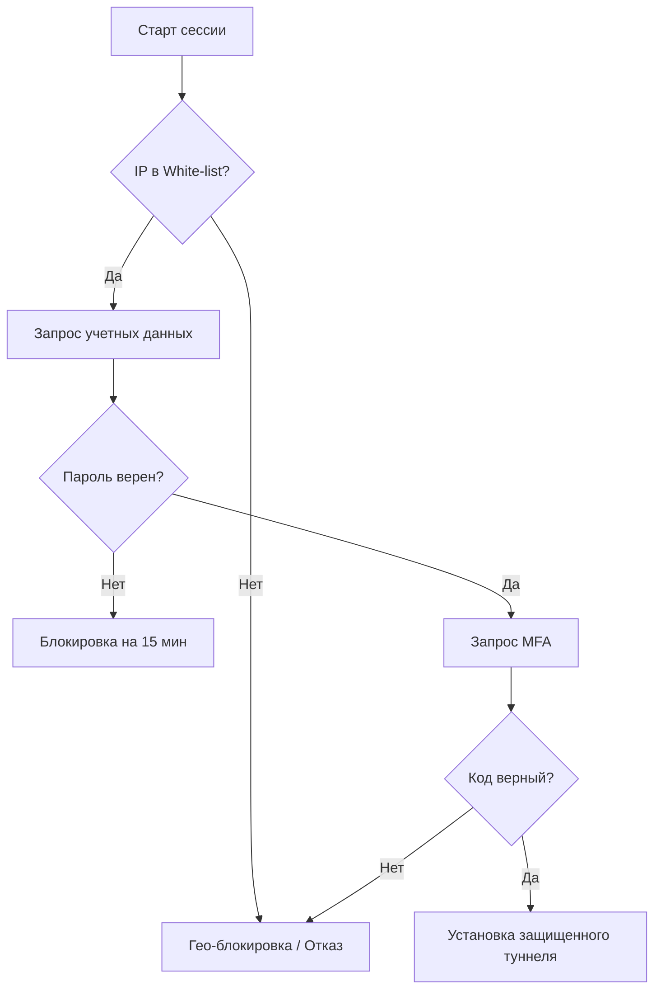

# Solution Design: Secure Remote Access System (VPN/MFA)

Проектное решение (Technical Specification) по реализации системы защищенного удаленного доступа. 
Данный проект демонстрирует навыки системного анализа, проектирования требований и понимание основ сетевой безопасности.

---

## 📌 Обзор проекта
**Проблема:** Необходимость обеспечения безопасного доступа сотрудников к внутренним ресурсам (CRM, ERP, Git) из внешних сетей в условиях повышенных требований к кибербезопасности.

**Решение:** Проектирование системы VPN-шлюза с обязательной двухфакторной аутентификацией (MFA) и ролевой моделью доступа (RBAC).

---

## 📋 1. Анализ и управление требованиями

### 1.1 Бизнес-требования (BR)
* **BR.01:** Исключить несанкционированный доступ к внутреннему периметру компании.
* **BR.02:** Обеспечить прозрачный аудит всех попыток входа в сеть.

### 1.2 Функциональные требования (FR)
* **FR.01:** Аутентификация пользователей через корпоративный каталог (Active Directory/LDAP).
* **FR.02:** Поддержка второго фактора (TOTP/SMS) для подтверждения личности.
* **FR.03:** Принудительное завершение сессии при бездействии пользователя более 60 минут.
* **FR.04:** Хэширование паролей при передаче и хранении.

### 1.3 Нефункциональные требования (NFR)
* **NFR.01 (Безопасность):** Использование протокола TLS версии не ниже 1.2/1.3.
* **NFR.02 (Надежность):** Время доступности системы (Uptime) — 99.9%.
* **NFR.03 (Производительность):** Поддержка до 1000 одновременных сессий без деградации скорости.

---

## 🏗 2. Моделирование и дизайн процессов

### 2.1 Sequence Diagram (Процесс входа в сеть)
Диаграмма отражает взаимодействие между клиентом, шлюзом и сервером аутентификации.

### 2.2 Activity Diagram (Алгоритм принятия решения)
Логика проверки безопасности перед предоставлением доступа.

## 🌐 3. Сетевые характеристики и безопасность

### 3.1 Стек протоколов (TCP/IP & OSI)
* **Layer 3 (Network):** Использование туннелирования для изоляции внутреннего трафика.
* **Layer 4 (Transport):** Основной протокол **TCP (порт 443)** для гарантии доставки пакетов и обхода Firewall. Резервный — **UDP (порт 500/4500)** для IPsec.
* **Layer 7 (Application):** Проверка "здоровья" клиента (наличие актуального антивируса и обновлений ОС) перед авторизацией.

### 3.2 Соответствие регуляторам
* Проект учитывает требования **ФЗ-152** (Защита персональных данных) в части шифрования каналов связи.
* Анализ нормативной документации подтверждает необходимость использования сертифицированных крипто-провайдеров для передачи данных уровня "Конфиденциально".

---
## 📂 Структура проекта
* [Requirements](docs/requirements.md) — Техническое задание и матрица трассировки.
* [Diagrams](diagrams/) — Визуализация процессов (Data Flow, Sequence, State).
* [Compliance Analysis](regulations/compliance_analysis.md) — Анализ нормативной базы (ФСТЭК, ФЗ-152).

---
*Проект выполнен в рамках портфолио системного аналитика.*
