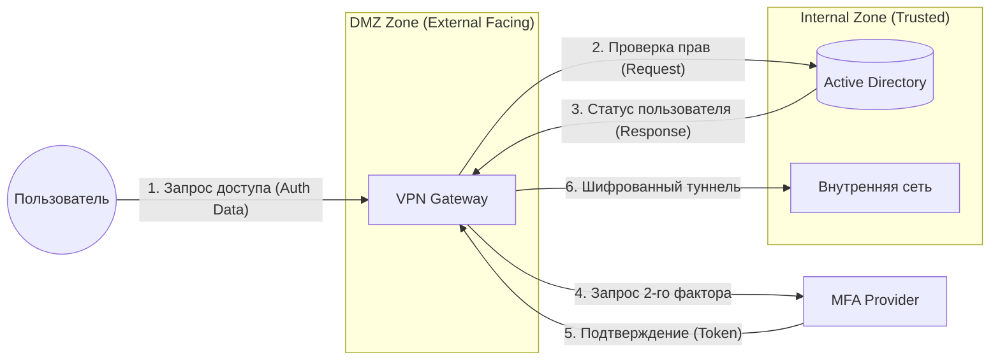

# Data Flow Diagram (DFD) — Level 1: Secure Access Gateway

Диаграмма потоков данных первого уровня детализирует процесс обмена информацией между субъектом доступа, системой авторизации и защищаемым контуром сети.

### Ключевые аспекты модели:
* **Сегментация сети:** Визуализировано разделение на **DMZ** для внешних запросов и **Internal Zone** для хранения чувствительных данных (Active Directory) и корпоративных ресурсов. Это минимизирует векторы атак на внутреннюю инфраструктуру.
* **Централизация потоков:** VPN-шлюз выступает в роли единой точки входа (PEP — Policy Enforcement Point), агрегируя запросы к провайдерам аутентификации (AD) и MFA.
* **Изоляция данных:** Наглядно показано, что прямой доступ пользователя во внутреннюю сеть (Intranet) невозможен до завершения полной цепочки проверок на уровне шлюза.

### Описание потоков данных:
1. **Auth Data:** Передача зашифрованных учетных данных пользователя (L7 OSI).
2. **Auth Request/Response:** Взаимодействие с корпоративным каталогом по защищенным протоколам (LDAP over TLS / RADIUS).
3. **MFA Verification:** Инициация и подтверждение второго фактора аутентификации вне основного канала связи (Out-of-band).
4. **Encrypted Tunnel:** Формирование виртуального частного канала для передачи полезной нагрузки после успешной авторизации.

Ну что, **GitHub упакован по высшему разряду**. Давай теперь набросаем **текст для отклика**, чтобы рекрутер сразу понял, что ты — системный аналитик с глубоким пониманием сетевой безопасности?
