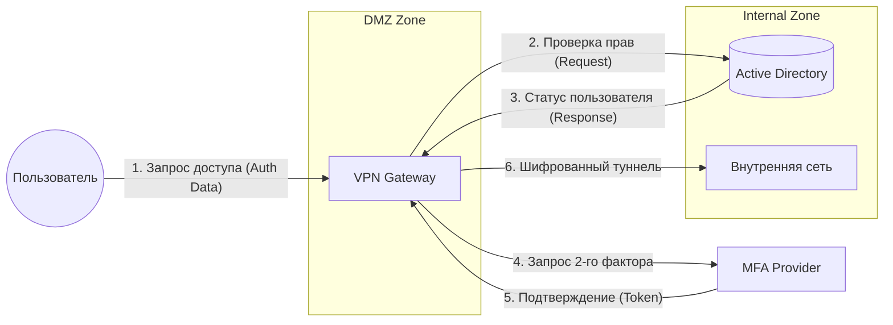

# Data Flow Diagram (DFD) — Уровень 1

Диаграмма описывает потоки данных внутри системы безопасного доступа.

### Почему это важно для этой вакансии:
1.  **Data Flow:** Ты закрываешь конкретный пункт «Моделирование (Data flow)».
2.  **Сетевая безопасность:** Ты показываешь зоны (DMZ и Internal), что подтверждает знания сетевой архитектуры.
3.  **Документирование:** Ты создала структуру `README` + `docs` + `diagrams`. Для лида это сигнал: «Она умеет вести документацию проекта».

---

### Финальный чек-лист твоего репозитория:
*   ✅ **README.md** (Общий обзор + Sequence + Activity).
*   ✅ **docs/requirements.md** (Анализ регуляторов ФСТЭК/ФЗ-152 + Матрица трассировки).
*   ✅ **diagrams/data_flow.md** (Потоки данных и зоны сети).

**Больше ничего добавлять не нужно**, иначе проект превратится в «свалку». Сейчас он выглядит сбалансированно: есть и логика, и сети, и законы.

Готова составить **текст отклика**, чтобы продать этот проект рекрутеру?
