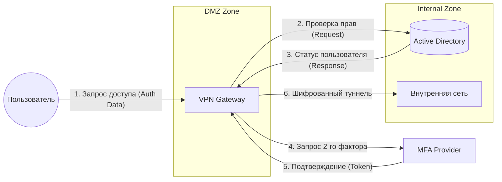

# Data Flow Diagram (DFD) — Level 1

На данной диаграмме представлен первый уровень декомпозиции потоков данных системы удаленного доступа. 
Здесь отражены основные функциональные компоненты и их взаимодействие.

