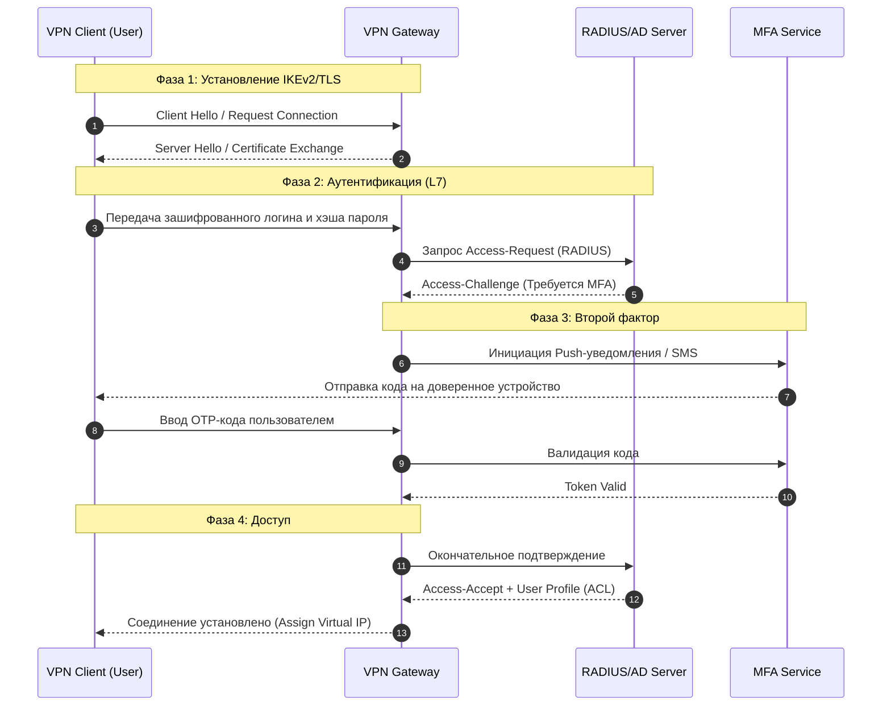

# Detailed Sequence Diagram: Authentication & Tunnel Establishment

Диаграмма детально описывает процесс установления защищенного соединения и обмена сообщениями между компонентами.

```mermaid
sequenceDiagram
    autonumber
    participant U as VPN Client (User)
    participant GW as VPN Gateway
    participant RAD as RADIUS/AD Server
    participant MFA as MFA Service

    Note over U, GW: Фаза 1: Установление IKEv2/TLS
    U->>GW: Client Hello / Request Connection
    GW-->>U: Server Hello / Certificate Exchange
    
    Note over U, RAD: Фаза 2: Аутентификация (L7)
    U->>GW: Передача зашифрованного логина и хэша пароля
    GW->>RAD: Запрос Access-Request (RADIUS)
    RAD-->>GW: Access-Challenge (Требуется MFA)
    
    Note over GW, MFA: Фаза 3: Второй фактор
    GW->>MFA: Инициация Push-уведомления / SMS
    MFA-->>U: Отправка кода на доверенное устройство
    U->>GW: Ввод OTP-кода пользователем
    GW->>MFA: Валидация кода
    MFA-->>GW: Token Valid
    
    Note over GW, U: Фаза 4: Доступ
    GW->>RAD: Окончательное подтверждение
    RAD-->>GW: Access-Accept + User Profile (ACL)
    GW-->>U: Соединение установлено (Assign Virtual IP)
```
