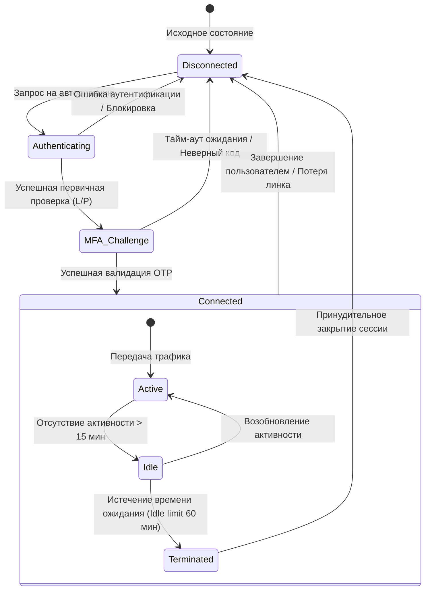

# Session State Diagram (Диаграмма состояний сессии)

Данная модель описывает жизненный цикл пользовательской сессии и логику переходов между состояниями в процессе установления и поддержания защищенного соединения.

### Назначение диаграммы:
* **Формализация логики доступа:** Определение условий перехода из стадии аутентификации в стадию активного соединения.
* **Управление ресурсами:** Визуализация логики обработки неактивных сессий (Idle timeout) для оптимизации нагрузки на VPN-шлюз.
* **Обеспечение безопасности:** Описание сценариев принудительного разрыва соединения при нарушении условий политики безопасности или системных сбоях.

### Ключевые переходы:
1. **Idle Limit:** Реализация нефункционального требования к безопасности по автоматическому закрытию неиспользуемых туннелей.
2. **Termination:** Гарантированный возврат системы в состояние `Disconnected` для высвобождения лицензий и IP-адресов в пуле.
