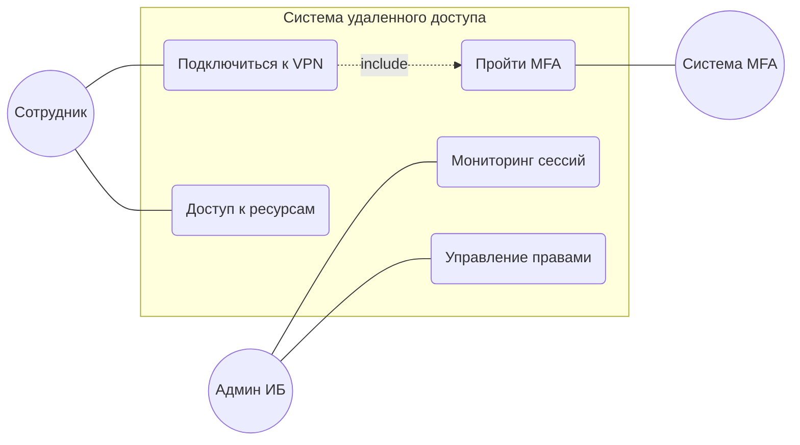

# Use Case Diagram (Диаграмма вариантов использования)

Данная диаграмма декомпозирует функциональность системы на уровне ролей пользователей (акторов) и их ключевых бизнес-целей. 
Она служит связующим звеном между бизнес-требованиями и технической реализацией.

### Описание ролей:
*   **Сотрудник (User):** Основной субъект доступа, инициирующий сессию для выполнения рабочих задач.
*   **Администратор ИБ (Security Admin):** Контролирующая роль, отвечающая за настройку политик доступа и мониторинг инцидентов.
*   **Система MFA:** Внешний функциональный компонент, обеспечивающий второй фактор аутентификации.

### Ключевые сценарии:
1.  **Подключение к VPN:** Основной процесс доступа, который включает в себя обязательную проверку второго фактора (отношение `include`).
2.  **Доступ к ресурсам:** Реализация ролевой модели (RBAC) — пользователь получает доступ только к разрешенным сегментам сети после авторизации.
3.  **Администрирование:** Функции управления правами и аудита активных подключений для обеспечения прозрачности доступа.

---
### Соответствие бизнес-требованиям:
*   **Безопасность:** Реализована через обязательный сценарий MFA для всех типов подключений.
*   **Управляемость:** Обеспечена инструментами мониторинга и разграничения прав для администраторов.
